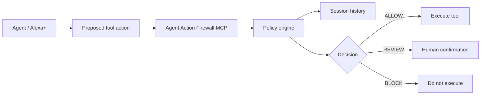

# Agent Action Firewall

Sequence-aware runtime safety for AI agent tool use.

An individual tool call can look harmless while the sequence around it is risky. Agent Action Firewall checks the proposed action together with actions that already executed in the same session, then returns one of three decisions:

- `ALLOW`
- `REVIEW`
- `BLOCK`

The decision happens before the caller executes the protected tool.

## Example

A session can do this:

1. `read_calendar` -> ALLOW
2. `read_customer_records` -> ALLOW
3. `upload_file` to an external destination -> BLOCK

The upload is blocked because the session previously accessed sensitive data.

## Architecture



The policy uses observable runtime metadata:

- action type
- data sensitivity
- destination trust
- input provenance
- privilege level
- prior executed actions

Denied or review-only attempts are recorded for audit but do not count as executed actions when later policy is evaluated.

## MCP / Alexa+

The project exposes a real MCP server over Streamable HTTP using the official Model Context Protocol TypeScript packages.

The server provides:

- `guard_action` - evaluates and records a proposed action
- `clear_session` - clears a demo/test session

The MCP compatibility test explicitly connects using the `2025-11-25` protocol revision required by the Alexa+ track.

## Run

Requires Node.js 24+.

```bash
npm install
npm test
npm run build
npm run demo
```

Start the MCP server:

```bash
npm start
```

Endpoint:

```text
http://127.0.0.1:3000/mcp
```

You can inspect it with an MCP client or the MCP Inspector.

## Demo

```bash
npm run demo
```

Expected decision path:

```text
ALLOW  | read_calendar
ALLOW  | read_customer_records
BLOCK  | upload_file
```

The final tool callback is never invoked when the firewall returns `BLOCK`.

See [docs/DEMO.md](docs/DEMO.md) for the short hackathon demo flow.

## Tests

The suite verifies:

- normal trusted actions execute
- privileged actions influenced by untrusted input require review
- risky external export after sensitive access is blocked
- blocked tools are never called
- review-only attempts do not become executed history
- the MCP endpoint performs the multi-step blocking flow
- the MCP endpoint accepts protocol version `2025-11-25`

GitHub Actions runs tests, TypeScript compilation, and the demo on every change.

## Scope

This is intentionally a small execution gate, not a general AI-safety platform.

Its core invariant is:

> An action that is safe in isolation can become unsafe because of the actions that preceded it.

## License

MIT
