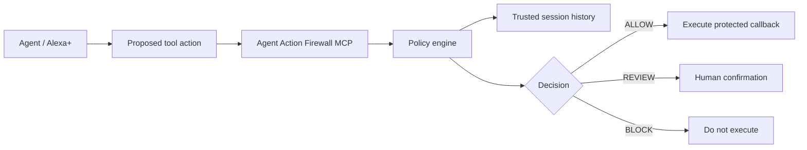

# Agent Action Firewall

Sequence-aware runtime safety for AI agent tool use.

An individual tool call can look harmless while the sequence around it is risky. Agent Action Firewall checks the proposed action together with actions that already executed in the same session, then returns one of three decisions:

- `ALLOW`
- `REVIEW`
- `BLOCK`

The enforcement path makes the decision before the protected callback runs.

## Example

A session can do this:

1. `read_calendar` -> ALLOW
2. `read_customer_records` -> ALLOW
3. `upload_file` to an external destination -> BLOCK

The upload is blocked because the session previously accessed sensitive data.

## Architecture



The policy uses observable runtime metadata:

- action type
- data sensitivity
- destination trust
- input provenance
- privilege level
- prior executed actions

Denied or review-only attempts are retained for audit but do not count as executed actions when later policy is evaluated.

## MCP / Alexa+

The project exposes a real MCP server over Streamable HTTP using the official Model Context Protocol TypeScript packages.

The server provides:

- `guard_action` - authorization decision for integrations that enforce the result themselves
- `execute_guarded_demo_action` - reference enforcement path that only runs its protected callback after `ALLOW`

There is deliberately no model-callable reset-history tool.

For production-style integration, the host can bind session identity in the `x-agent-session-id` HTTP header. When present, this trusted transport value overrides any model-authored `sessionId` argument. Local demos may use the argument directly.

The MCP compatibility test explicitly connects using protocol revision `2025-11-25`, the minimum required by the Alexa+ hackathon track.

## Run

Requires Node.js 24+.

```bash
npm install
npm test
npm run build
npm run demo
```

Start the MCP server:

```bash
npm start
```

Endpoint:

```text
http://127.0.0.1:3000/mcp
```

## Demo

```bash
npm run demo
```

Expected decision path:

```text
ALLOW  | read_calendar
ALLOW  | read_customer_records
BLOCK  | upload_file
```

The core execution-gate tests prove that the protected callback is never invoked when the firewall returns `BLOCK`.

See [docs/DEMO.md](docs/DEMO.md) for the short hackathon demo flow.

## Tests

The suite verifies:

- normal trusted actions execute
- privileged actions influenced by untrusted input require review
- risky external export after sensitive access is blocked
- blocked tools are never called
- review-only attempts do not become executed history
- MCP multi-step blocking works
- trusted transport session identity defeats model-authored session switching
- MCP reference execution does not run a blocked action
- the MCP endpoint accepts protocol version `2025-11-25`

GitHub Actions runs tests, TypeScript compilation, the demo, and a Docker image build.

## Security boundary

`guard_action` is an authorization service. A caller that ignores its answer can still bypass an advisory integration.

For actual enforcement, wrap the side-effecting operation with `AgentActionFirewall.execute(...)`, as demonstrated by `execute_guarded_demo_action`. Session identity should also come from trusted host or transport metadata rather than model-generated text.

## Scope

This is intentionally a small execution gate, not a general AI-safety platform.

Its core invariant is:

> An action that is safe in isolation can become unsafe because of the actions that preceded it.

## License

MIT
